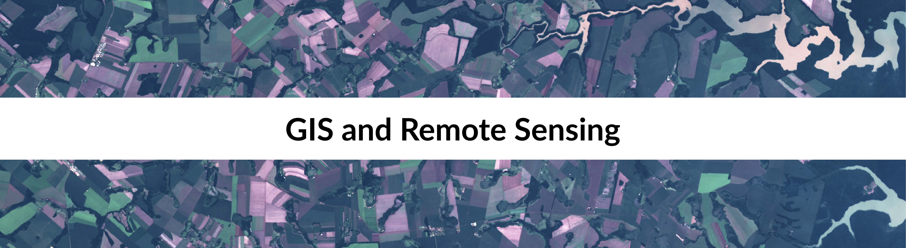

# Research repository

## Description
Here, I share some of my research for Earth Observation and agricultural monitoring using GIS (Geographic Information System) and Remote Sensing. Most of them use KDD (Knowledge-Discovery in Databases) concept and Machine Learning techniques. All publications listed here were already published in conferences or journals.
(published in conferences or journals)

## Projects :earth_americas: :satellite:

*  [Land cover mapping with Landsat-8 for Tupãssi, Brazil, using Google Earth Engine;](https://github.com/cavalcante-l/GIS/tree/master/Google_Earth_Engine/Tupassi)
 
*  AisaFENIX Hyperspectral image processing; 

## Disclaimer 
I developed or participated in some parts of the research, as in data acquisition, processing, or writing. If you have any question, please send an email, I will be happy to help. 

## Acknowledgments
This repository is under construction.